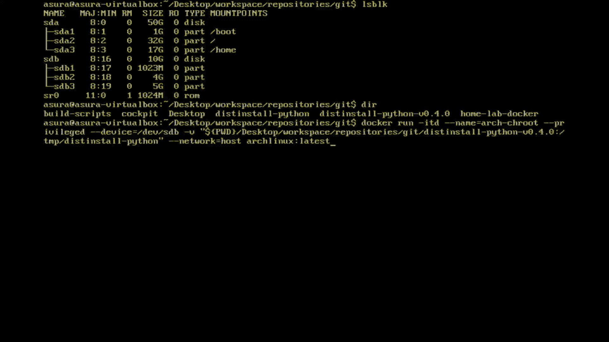
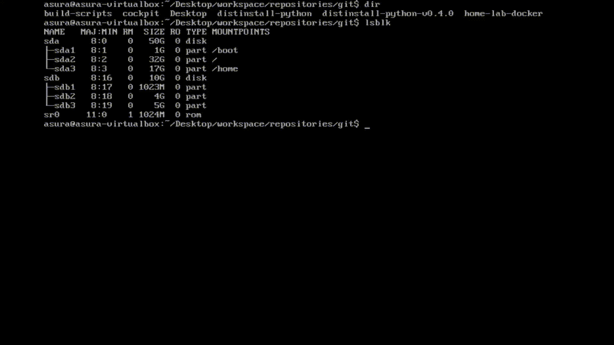

# Demo

## Setup
### Running from a non-target distro-based Environment
#### Information
- Pre-Requisites
   + Chroot environment

- Demo Contents
   + Startup Docker container for non-ArchLinux chroot environment
   + Jumping into the chroot environment

#### Setup chroot environment
##### Using Docker
- Startup Docker container
    - ArchLinux chroot environment
        + 

- Chroot/Exec into Docker container
    - ArchLinux chroot environment
        + 
        + 

### Running from a target distro-based Environment
- Setup working environment
    + 

## Main Process
### Notes
- The following steps have been recorded while running from an arch-linux based chroot environment as part of the development test and demonstration recording
    + However, the steps past this point are entirely repeatable/recreatable according to the demo provided below

- In the case of installation of a target distribution from a system that is not running the same distribution as the target distribution
    + Please remember to follow the [Setup](#Setup) steps above before proceeding

### Running from an ArchLinux-based Environment
- Generate configuration file
    + 

- Edit configuration file
    + 

- Run
    - Using run.sh
        + 
    - Using 'start'
        + 
    - Executing specific stages
        + 

## Resources

## References

## Remarks

